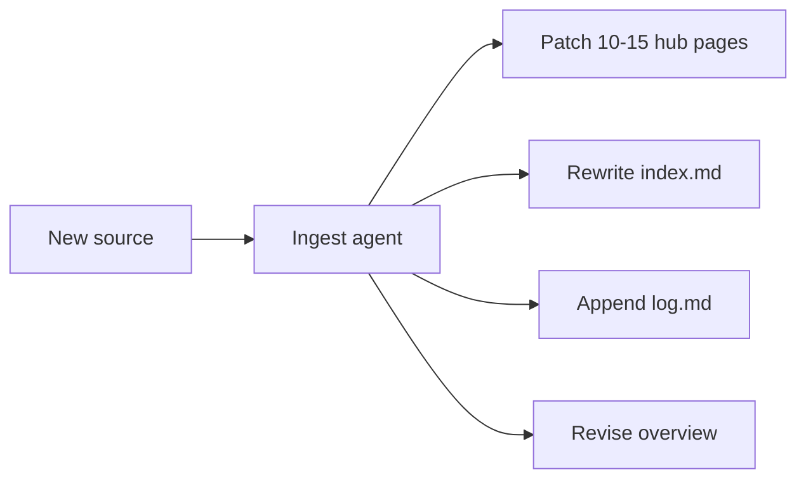
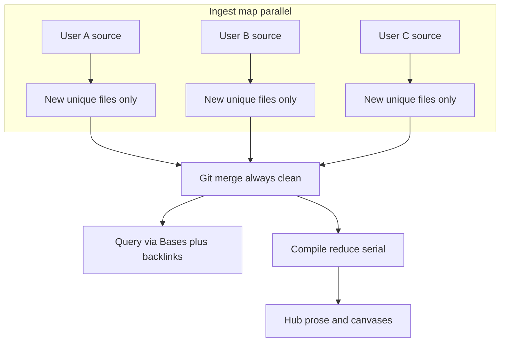

# Conflict-free collaborative LLM Wiki

## What this repo is

[`/Users/llohann/repos/integrated-brain`](/Users/llohann/repos/integrated-brain) is the repo root (not a nested `Untitled/` folder). It will become a **reusable Obsidian + Agent Skills pack** (Karpathy’s idea file + kepano’s skill shape), not a Leonardo-specific wiki.

`[~/leonardo/codebase/leonardo-internal](/Users/llohann/leonardo/codebase/leonardo-internal)` is the **later test case**. It already instantiates the original gist: every ingest patches hubs, `[wiki/index.md](/Users/llohann/leonardo/codebase/leonardo-internal/wiki/index.md)`, `[wiki/log.md](/Users/llohann/leonardo/codebase/leonardo-internal/wiki/log.md)`, `[wiki/hot.md](/Users/llohann/leonardo/codebase/leonardo-internal/wiki/hot.md)`, and `[wiki/skills-map.md](/Users/llohann/leonardo/codebase/leonardo-internal/wiki/skills-map.md)`. Those shared files are the conflict surface.

## Research analogue (the find)

The closest Karpathy-wiki-for-research/discovery project is **[AutoSci](https://github.com/skyllwt/AutoSci)** (evolved from [OmegaWiki](https://github.com/skyllwt/OmegaWiki)).

- Tagline: “Karpathy's LLM-Wiki vision, fully realized — wiki-centric full-lifecycle AI research”
- Paper: [arXiv:2605.31468](https://arxiv.org/abs/2605.31468) (*AutoSci: A Memory-Centric Agentic System for the Full Scientific Research Lifecycle*)
- Discovery loop: `/discover` ranks papers against the existing wiki (venue/year, topics already tracked) **without ingesting**; `/daily-arxiv` is the ongoing feed; `/ingest` compiles papers into typed wiki pages
- They already hit the parallel-ingest problem and solved it with **git worktrees + `merge=union` on `index.md` / `log.md` / `edges.jsonl`**, then a serial fan-in that skips topic-page updates during ingest

We will **not clone AutoSci** (experiments, papers, rebuttals). We take a stricter conflict rule than theirs: independent users should not need worktrees or union-merge. Nearby but thinner: [MetamusicX/llm-research-wiki](https://github.com/MetamusicX/llm-research-wiki) and Hermes’s bundled `research-llm-wiki` skill.

## Why the gist conflicts

Karpathy ingest is a **read-modify-write** of shared pages:




Two independent users ingesting at once both edit `index.md`, `log.md`, and the same hub. Git cannot merge that. AutoSci’s `merge=union` only papers over append-only files; it still needs a serial merge brain for concept pages, and two users can still create `eori.md` vs `eori-number.md` (gist comment: 38% near-duplicates on concurrent ingest).

## Redesign: map is create-only; reduce is serial




**Hard ingest rule:** ingest may **create** a file whose path is unique. It must **not modify any existing file**. Even append-only `log.md` is forbidden (two appends to the same file still conflict).

Unique paths:

- `raw/{contributor}/{source-id}/...` — immutable sources
- `wiki/sources/{source-id}.md` — one source note (`source-id` = slug or content hash)
- `wiki/contributions/{hub-id}/{source-id}.md` — what this source adds to a hub (claims, next actions, evidence)
- `wiki/log/{YYYY-MM-DD}-{source-id}.md` — one log entry per ingest
- `wiki/aliases/{alias}.md` — slug reservation (`canonical: eori-number`) so concurrent ingests do not fork names
- Wikilinks to hubs even if the hub file does not exist yet (Obsidian unresolved links)

**Do not write on ingest:** `index.md`, `log.md`, `hot.md`, `skills-map.md`, hub bodies, trees, overview.

**Query works immediately** without compile: Obsidian Bases filter frontmatter (`type`, `hub`, `status`, `date`); backlinks on a hub name collect contributions.

**Compile** (one maintainer or CI, after merge) is the only process allowed to rewrite derived files:

- Hub pages under `wiki/hubs/` (or `wiki/projects/` in Leonardo): synthesized prose, “current next action”, contradiction callouts
- Optional JSON Canvas maps
- Optional `wiki/hot.md` as a derived session cache (gitignored or compile-owned)

Human corrections are **pins** (`wiki/pins/{hub-id}/{id}.md`), not edits to compiled prose — so the next compile does not revert them (lesson from the gist’s team-scale comment).

## Writing style (kepano/obsidian-skills)

Match [kepano/obsidian-skills](https://github.com/kepano/obsidian-skills), not Karpathy’s essay voice:

- Agent Skills spec: YAML `name` + `description` (“Use when…”)
- Numbered workflows, attribute tables, complete examples, **validation checklists**, `references/` split
- First-class Obsidian: wikilinks, properties, callouts, [Bases](https://github.com/kepano/obsidian-skills/blob/main/skills/obsidian-bases/SKILL.md), [JSON Canvas](https://github.com/kepano/obsidian-skills/blob/main/skills/json-canvas/SKILL.md)
- Depend on kepano’s skills for markdown/bases/canvas/defuddle; do not re-teach CommonMark
- README install section in the same marketplace / `npx skills add` / clone-into-skills-dir shape

Replace Karpathy’s `index.md` catalog with **Bases** (this is the kepano-native substitute for Dataview). Replace graph-view-only navigation with optional `.canvas` files generated at compile time.

## Deliverable layout in this repo

```
README.md
SCHEMA.md                 # redesigned idea file (Karpathy pattern + conflict rules)
AGENTS.md                 # short pointer: read SCHEMA.md, follow skills
skills/
  wiki-ingest/SKILL.md
  wiki-query/SKILL.md
  wiki-lint/SKILL.md
  wiki-compile/SKILL.md
  wiki-ingest/references/PAGE-TYPES.md
  wiki-compile/references/PINS.md
vault/                    # minimal scaffold, not Leonardo content
  raw/.gitkeep
  wiki/sources/
  wiki/contributions/
  wiki/log/
  wiki/aliases/
  wiki/pins/
  wiki/hubs/
  wiki/sources.base
  wiki/log.base
  wiki/contributions.base
```

Skill responsibilities:

- **wiki-ingest** — classify source; write source note + contribution notes + log file + alias stubs; wikilink hubs; never patch hubs; validation: “`git status` shows only added files”
- **wiki-query** — read Bases / backlinks first; cite pages; offer to file the answer as a new unique page (decision/contribution), not a hub rewrite
- **wiki-lint** — unresolved wikilinks, alias collisions (`eori` vs `eori-number`), contribution hubs with no compile, stale pins, orphan sources
- **wiki-compile** — serial reduce: merge contributions into hub prose, apply pins, rebuild canvases; the only skill that edits existing derived files

Frontmatter (Obsidian properties) on every created note, e.g. `type`, `source_id`, `contributor`, `hubs`, `date`, `status`. Bases are the index.

## Phase 2 (after this repo is complete)

Convert `[leonardo-internal](/Users/llohann/leonardo/codebase/leonardo-internal)` as the test case — **not in the first implementation pass**:

- Point its ops skills at this pack (or copy skills once, then symlink)
- Split `wiki/log.md` into per-ingest files; replace `wiki/index.md` / `skills-map.md` with Bases over existing hub frontmatter
- Change `wiki-ingest` from “patch 10–15 pages” to create-only contributions; keep hub ids (`megazord`, `dataset-release`, …) as wikilink targets
- Run compile once to refresh hub “Next agent action” from contribution files
- `wiki/hot.md` becomes compile-owned or gitignored

Leonardo ontology (project / tree / decision / `agent_ready`) stays in `leonardo-internal` `AGENTS.md`; this repo stays domain-agnostic.