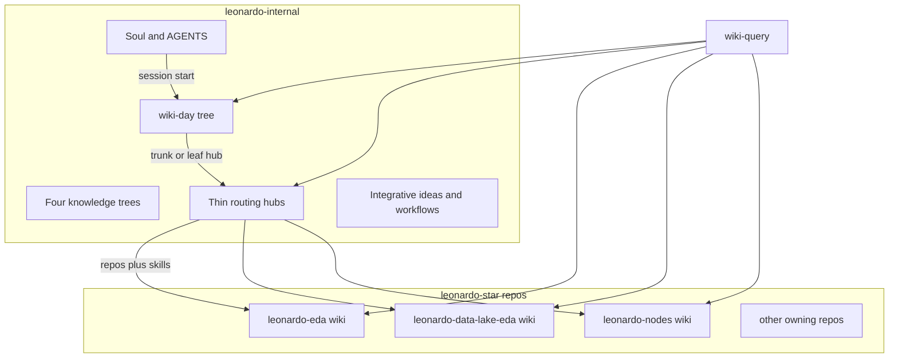

# Federated Leonardo wiki

Rejected the previous plan (keep all wiki material in [leonardo-internal](/Users/llohann/leonardo/codebase/leonardo-internal) and only change ingest to create-only). New split: **internal is the cortex; each `leonardo-`* repo is a lobe.**

Sync model (chosen): **federate reads**. No copying log/hot into every repo. No star replica.

## Why this is a better fit

You already split **procedures**: repo `SKILL.md` files stay in the owning repo; internal only points at them ([skills-map](/Users/llohann/leonardo/codebase/leonardo-internal/wiki/skills-map.md)). Domain **memory** should follow the same rule. A data-request next-action belongs next to `leonardo-eda` skills, not in a 41-hub megawiki that every agent patches.

Conflict-freedom then falls out of geography: work in `leonardo-eda` only adds files there. Two agents in two repos never share a file. The remaining shared surface is small on purpose: routing cards, four knowledge trees, **wiki-day**, cross-cutting ideas, soul.

## What lives where




**leonardo-internal keeps**

- Soul, [AGENTS.md](/Users/llohann/leonardo/codebase/leonardo-internal/AGENTS.md), `install_wiki_soul.sh`
- Four knowledge trees ([data-delivery](/Users/llohann/leonardo/codebase/leonardo-internal/wiki/trees/data-delivery.md), development, ai-automation, labs-discovery)
- **wiki-day** as the only session DAG (`wiki/days/YYYY-MM-DD.md`) — trunks/leaves wikilink routing hubs
- Thin routing hubs: `id`, `agent_ready`, `depends_on` / `blocks`, `repos`, skill pointers, one-line purpose. Not the live next-action essay
- Integrative workflows that **stitch repos** (e.g. LC ingest cycle: lake → dashboards → retriever). [dataset-release](/Users/llohann/leonardo/codebase/leonardo-internal/wiki/projects/dataset-release.md) is the example: four repos, one definition of done
- Integrative ideas that do not belong to one codebase
- Hubs with **no owning repo** (labs, strategy-2030, IRP student work, data-architecture): full pages stay here
- Mail **routing table** (which repo wiki to ingest into)

**Each owning `leonardo-`* repo gets**

- `wiki/` for that codebase: next-actions, decisions, evidence, source notes
- `wiki/log/{YYYY-MM-DD}-{slug}.json` — one file per event (never a shared `log.md`)
- `wiki/hot.json` — that repo’s session cache (overwrite locally; last writer in *this* repo wins)
- Short `AGENTS.md` / soul pointer: local wiki first, then federate to internal for day/routing

**Do not move** repo skills; they already live correctly.

## Log and hot as JSON (not one markdown file)

A single `log.md` / `hot.md` cannot be “synced” without merge fights. Unique JSON files plus federated **read** is the same create-only idea as the [wiki-reduce pack](/Users/llohann/repos/wiki-reduce/SCHEMA.md), in a form tools can sort.

**Log event** (one file, add-only):

```json
{
  "id": "2026-08-17-mail-abc123",
  "ts": "2026-08-17T15:06:00+02:00",
  "repo": "leonardo-eda",
  "op": "ingest",
  "hub": "data-requests",
  "title": "mail abc123",
  "summary": "…",
  "paths": ["wiki/sources/…"]
}
```

Path: `wiki/log/2026-08-17-mail-abc123.json` in the **owning** repo. Internal integrative ops use the same shape under `leonardo-internal/wiki/log/`.

**Hot** (one file per repo, overwrite OK):

```json
{
  "updated": "2026-08-17T17:00:00+02:00",
  "repo": "leonardo-eda",
  "focus_hub": "data-requests",
  "day": "2026-08-17",
  "do_next": "Send Matteo drafted reply",
  "blockers": [],
  "day_page": "~/leonardo/codebase/leonardo-internal/wiki/days/2026-08-17.md"
}
```

Federated “what is hot” is **computed at query time**: glob `~/leonardo/codebase/*/wiki/hot.json`, sort by `updated`, plus always read today’s **internal** day page. Do not merge hot files on disk.

Obsidian Bases do not query JSON. That is acceptable if the day tree (markdown) is the human map and agents consume JSON. If a repo vault must show a log table in Obsidian, add a later compile-to-`.base` or mirror events as markdown-with-YAML (isomorphic schema) — not a single append-only `log.md`.

## wiki-day stays the overarching tree

Keep [wiki-day](/Users/llohann/leonardo/codebase/leonardo-internal/.cursor/skills/wiki-day/SKILL.md) only in leonardo-internal. It is how you integrate work across lobes.

- Trunk/leaf still records hub + depth on `wiki/days/YYYY-MM-DD.md`
- Leaf may name a hub whose **body** lives in another repo; the day page stores the hub id and repo, not the next-action prose
- Park still files ideas: local to a repo if the idea is about that codebase; internal `wiki-idea` if it is integrative
- Hybrid exception remains: one human, one day page (two `wiki-day` agents the same day can still collide). Do not split day leaves unless that actually happens
- `hot.json` in a working repo should point at that day page (`day_page` field) so federation always finds the tree

Morning briefing: read internal day + federated hots, pick 1–3 trunks, write the day page, then set local `hot.json` in whichever repo the first trunk owns.

## Soul (still owned here, installed everywhere)

Session start in any `leonardo-*` repo:

1. Read internal AGENTS + today’s day page
2. Read **this repo’s** `wiki/hot.json` if present
3. Match routing hub in internal → load listed repo skills and **that repo’s** wiki (may be local)
4. File outcomes as a **new log JSON** in the repo where the work happened; update **that** `hot.json`
5. Do not append internal `wiki/log.md` or patch internal hub next-action from a sibling repo

Re-run `install_wiki_soul.sh` after the soul text changes.

## Multi-repo hubs

[dataset-release](/Users/llohann/leonardo/codebase/leonardo-internal/wiki/projects/dataset-release.md) (lake + embeddings + retriever) stays a **routing + integrative workflow** page in internal. Slice next-actions live in each owning repo (`leonardo-data-lake-eda`, `leonardo-llm-deployment`, `leonardo-golden-retriever`). Internal compile/query unions those log/hot files when answering “where is LC ingest”.

[data-requests](/Users/llohann/leonardo/codebase/leonardo-internal/wiki/projects/data-requests.md) is the easy case: one repo (`leonardo-eda`) owns almost all thick content.

## Skills

Vendor-copy generic wiki-ingest/query/lint/compile from [wiki-reduce](/Users/llohann/repos/wiki-reduce) into internal, then specialize:

- **wiki-query** (internal): day page → routing hub → glob sibling `wiki/hot.json` + `wiki/log/*.json` + that repo’s markdown wiki
- **wiki-ingest** (internal): mail routing table decides **target repo**; write source/contribution/log JSON **there** (agent must have that folder open or write via absolute path)
- Per-repo ingest: create-only into **local** `wiki/`
- **wiki-compile**: optional per-repo hub prose; internal compile only for routing cards and integrative workflow pages

Do not copy 1,397 Monday items. Do not copy repo SKILL.md files into internal.

## Migration sequence

1. JSON schemas + federated glob in the wiki-reduce pack (so the contract is reusable)
2. Slim a few internal hubs to routing cards; leave labs/IRP thick on internal
3. Seed `leonardo-eda` wiki first (autonomous, single-repo) with hot.json + split of related log lines
4. Update soul to federate; stop sibling repos writing internal `log.md`
5. Repeat for lake, nodes, visualizations, consolidation
6. Split remaining internal `log.md` into JSON (internal vs per-repo by hub/repos field)
7. Keep wiki-day as-is aside from log lines becoming JSON on internal

## Out of scope

- AutoSci-style discover/experiments
- N-way copy of hot/log into every repo
- Renaming `wiki/projects/` stems (`[[megazord]]` stays the routing id)

